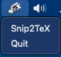

# LatexOCR Menu Bar App

This is a simple Menu Bar app for macOS that allows you to execute `LatexOCR`, a command-line tool for OCR of math equations.

This would not have been possible if not for the great work by [Lukas Blecher's LaTeX OCR Project](https://github.com/lukas-blecher/LaTeX-OCR)

<div style="display:flex;">
    
</div>

<br>
<center>
<div style="display;">
    
</div>
</center>

## Installation

### Step 1: Install LatexOCR

Install `LatexOCR` by running the following command in your preferred `conda env`:

```
pip install latexocr
```

Or

```
pip install 'pix2tex[gui]'
```


### Step 2: Clone this repository

Clone this repository to your local machine by running the following command:

```
git clone https://github.com/shanto268/LatexOCR-Menu-Bar-App.git
```


### Step 3: Install the required libraries

Install the required libraries by running the following command:

```
pip install rumps
```


### Step 4: Set the path to LatexOCR

Open the `snip2tex.py` file and set the `command` variable to the path of the `latexocr` command on your system.

**Path of `latexocr` can be found by** `which latexocr` 


### Step 5: Run the app

Run the app by running the following command:

```
python snip2tex.py
```

## License

This project is licensed under the MIT License - see the [LICENSE](LICENSE) file for details.
