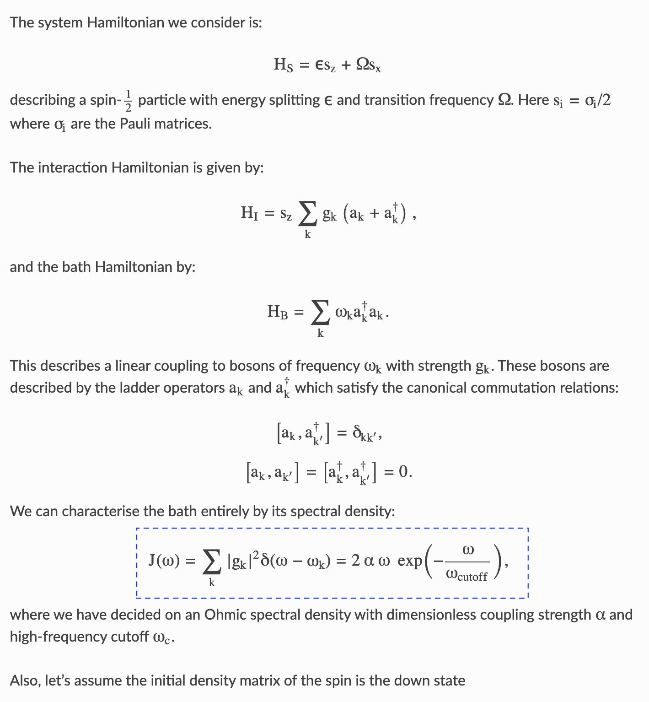

# LatexOCR Menu Bar App

<div style="display:flex;">
    
</div>

<br>

This is a simple Menu Bar app for macOS and a simple GUI app for Windows and Linux that allows you to execute `LatexOCR`, a command-line tool for OCR of math equations.

This would not have been possible if not for the great work by [Lukas Blecher's LaTeX OCR Project](https://github.com/lukas-blecher/LaTeX-OCR)

## Installation

### Step 1: Install LatexOCR

Install `LatexOCR` by running the following command in your preferred `conda env`:

```
pip install latexocr
```

or 

```
pip install 'pix2tex[gui]'
```

### Step 2: Clone this repository

Clone this repository to your local machine by running the following command:

```
git clone https://github.com/shanto268/LatexOCR-Menu-Bar-App.git
```

### Step 3: Install the required libraries

#### macOS
Install the required library by running the following command:

```
pip install rumps
```

#### Windows and Linux
Install the required library by running the following command:

```
pip install pysimplegui
```


### Step 4: Set the path to LatexOCR

Open the `snip2tex.py` file and set the `command` variable to the path of the `latexocr` command on your system.

**Path of `latexocr` can be found by** `which latexocr` (macOS and Linux) or by searching for the location of the `latexocr.exe` file (Windows)


### Step 5: Run the app

Run the app by running the following command:

```
python snip2tex.py
```


## Usage

### macOS
After running the app, it should create a Menu Bar Tool -  and all you need to do is press `Snip2TeX` and then a new window (*left figure below*) would pop up.

Click on the `Snip` button or press `Option+S` and then it would act like a screenshot feature (blue region below) similar to what happens when you press `Cmd+Shift+4` (*middle figure below*)

but now whatever feature you cover should be an equation and once you are done **snapping** it will generate the corresponding `LaTeX` code that you can simply copy (*right figure below*)

<center>
<div style="display:flex;">
    
    
    
</div>
</center>

### Windows and Linux
After running the app, a simple GUI window will appear with a "Snip2TeX" button and an output area. Press the "Snip2TeX" button to execute the LatexOCR command, and the output will be displayed in the output area. To close the application, press the "Quit" button.

## License

This project is licensed under the MIT License - see the [LICENSE](LICENSE) file for details.

